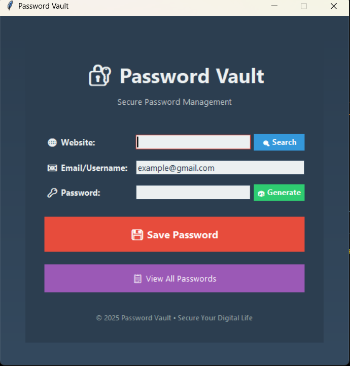
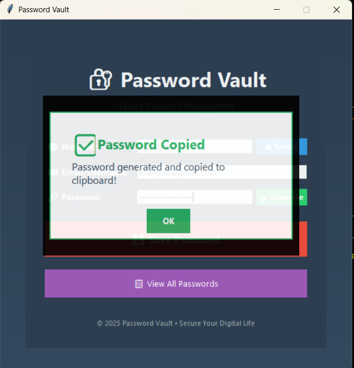
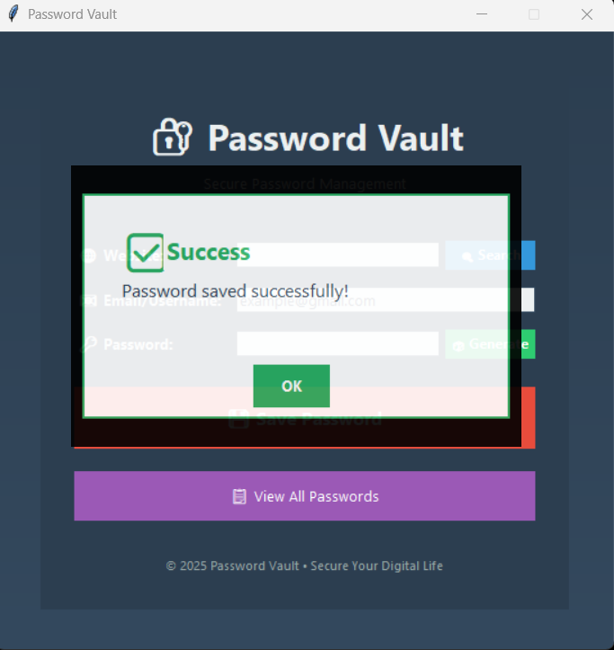
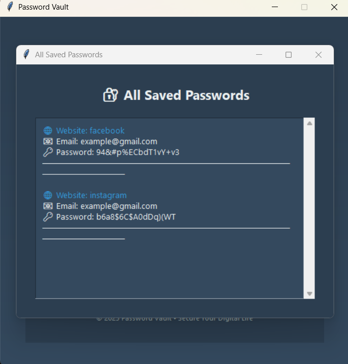
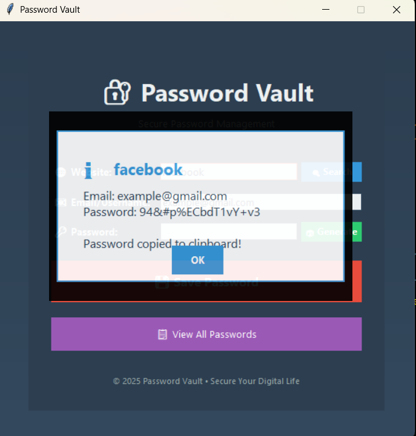

# 🔐 Password Vault GUI

A modern and user-friendly password manager built with [Tkinter](https://docs.python.org/3/library/tkinter.html) in Python.  
It allows you to **generate strong passwords, save them locally, search existing ones, and view all saved credentials** in a secure and visually appealing interface.

---

## ✨ Features

- 🎨 Beautiful modern GUI built using Tkinter
- 🧠 Random strong password generator
- 💾 Save credentials (website, email/username, password)
- 🔍 Search for saved credentials
- 📋 View all saved credentials with scrollable UI
- 📎 One-click password copy to clipboard
- ⚡ Smooth custom alert and confirmation popups
- 💽 Local JSON-based storage

---

## 📸 Screenshots

### Main Window


### Password generate


### Save Confirmation


### All Saved Passwords


### Search on the saved list


---

## 🚀 Getting Started

### Prerequisites
- [Python 3.10+](https://www.python.org/downloads/)
- Install the dependency:
  ```bash
  pip install pyperclip

  ---
   ### ⚙️ Installation

        1.Clone this repository
        git clone https://github.com/your-username/Password-Vault-GUI.git
        
        2.Move into the folder
        cd Password-Vault-GUI
        
        3.Run the application
        python main.py
  ----

###📁 Project Structure
Password-Vault-GUI/
│
├── main.py              # Main Tkinter application
├── data.json             # Local credential storage (auto-created)
├── screenshots/           # Place your UI screenshots here
│   ├── main_window.png
│   ├── password_generate.png
│   ├── password_saved.png
│   ├── all_saved_passwords.png
│   └── data_fetch.png
└── README.md
----
👨‍💻 Author
Jay Mondal
